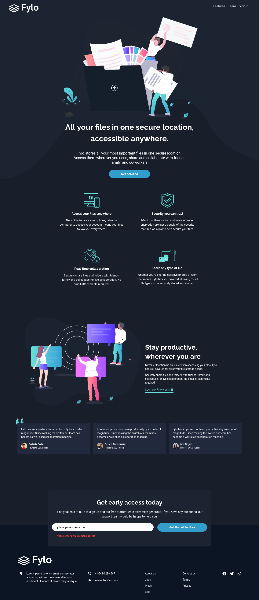
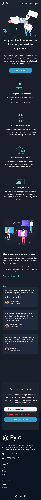

# Frontend Mentor - Fylo dark theme landing page solution

This is a solution to the [Fylo dark theme landing page challenge on Frontend Mentor](https://www.frontendmentor.io/challenges/fylo-dark-theme-landing-page-5ca5f2d21e82137ec91a50fd). Frontend Mentor challenges help you improve your coding skills by building realistic projects.

## Table of contents

- [Overview](#overview)
  - [The challenge](#the-challenge)
  - [Screenshot](#screenshot)
  - [Links](#links)
- [My process](#my-process)
  - [Built with](#built-with)
  - [Continued development](#continued-development)
- [Author](#author)

## Overview

### The challenge

Users should be able to:

- View the optimal layout for the site depending on their device's screen size
- See hover states for all interactive elements on the page

### Screenshot

<h2 align="center" >Desktop</h2>

 

 
 
<h2 align="center">Mobile</h2>

 

### Links

- Solution URL: [Frontend Mentor](https://www.frontendmentor.io/solutions/fylo-dark-theme-landing-page-Sk_hIhP7q)
- Live Site URL: [Vercel](https://fylo-landing-page-dark-theme-claude.vercel.app/)

## My process

### Built with

- Flexbox
- Mobile-first workflow
- [Next.js](https://nextjs.org/) - React framework
- [TailWind](https://tailwindcss.com/) - For styles but I really prefer manualy doing the styles
- [Typescript](https://www.typescriptlang.org/) - for typings on JS?

### Continued development

- Adding a proper breakpoint for table-like sizes

## Author

- Frontend Mentor - [@claude1018](https://www.frontendmentor.io/profile/claude1018)
